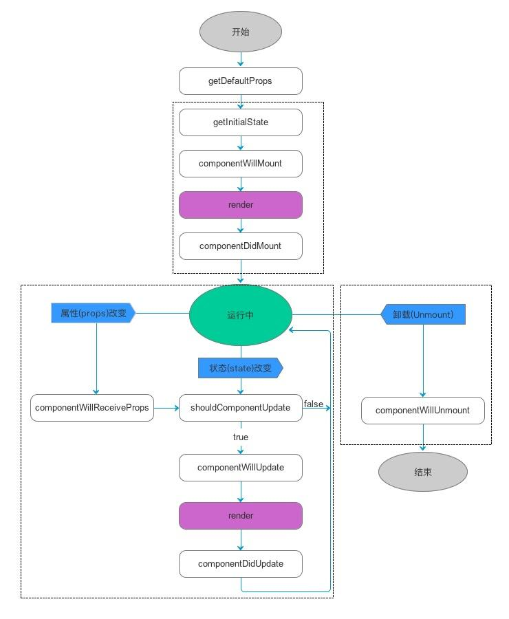

## React 组件开发知识

> React 基础开发知识建议优先访问官网文档，这里附上对应的中文站点：[http://react.yubolun.com/docs/hello-world.html](http://react.yubolun.com/docs/hello-world.html)

### 1、定义一个组件

无状态函数组件：
```
const element = <h1>Hello, world!</h1>;
```

使用 React.Component 定义组件：
```
import React, { Component } from 'react';

class MyComponent extends Component {
    constructor(props){
        super(props)
    }
    render(){
        return (
            <div> Hello Tinper React! </div>
        )
    }
}

export default MyComponent
```

### 2、理解 JSX 语法

**属性：**
```
const element = <div tabIndex="0"></div>;
```

**用{}包裹变量：**
```
const element = </img>;
```

**跟HTML一样可以嵌套：**
```
const element = (
  <div>
    <h1>Hello!</h1>
    <h2>Good to see you here.</h2>
  </div>
);
```

**逻辑表达式：**
```
function getGreeting(user) {
  if (user) {
    return <h1>Hello, {formatName(user)}!</h1>;
  }
  return <h1>Hello, Stranger.</h1>;
}
```

**定义css类名：**
```
const element = (
  <h1 className="greeting">
    Hello, world!
  </h1>
);
```

### 3、理解 Props、defaultProps 默认 props、PropType 接口校验

**props 是外部传入到组件的所有属性：**
```
const element = porps => <div>{props.url}</div>

```

**定义PropTypes：**
```
import React from 'react';
import PropTypes from 'prop-types';

class Greeting extends React.Component {
  render() {
    return (
      <h1>Hello, {this.props.name}</h1>
    );
  }
}

Greeting.propTypes = {
  name: PropTypes.string
};
```

**默认的props：**
```
import React from 'react';
import PropTypes from 'prop-types';

class Greeting extends React.Component {
  render() {
    return (
      <h1>Hello, {this.props.name}</h1>
    );
  }
}

Greeting.defaultProps = {
  name: 'tinper'
};
```
### 4、State、setState


### 5、掌握组件生命周期



### 6、理解事件处理


### 7、列表 & Keys


### 8、React 中的表单组件


### 9、组件的组合