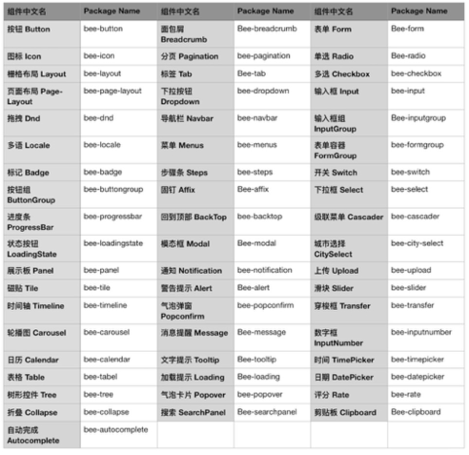

## 前端组件库

### 1、基础组件库 tinper-bee

tinper-bee 是基于 iuap design 设计语言构建的企业级组件库，包含丰富的基础组件和应用组件，支持组件的灵活调用和扩展，助力快速进行应用的组件化开发。组件库地址：http://bee.tinper.org



### 2、应用组件库 tinper-acs

- 参照组件：https://www.npmjs.com/package/yyuap-ref
- 城市级联选择组件：https://github.com/tinper-bee/bee-city-select
- 高级查询组件：https://github.com/tinper-acs/ac-search-panel
- 高级滑动组件：https://github.com/tinper-acs/ac-swiper-tab

### 3、第三方组件

- react-hot-keys：热键/快捷键组件
- react-custom-scrollbars：滚动条优化组件


### 4.1、Form

```
import Form from 'bee-form';

class List extends Component{
	render(){
        const { 
            validateFields,
            getFieldDecorator,
            getFieldError
        } = this.props.form;

		return (
			<FormItem>
                <span className="supplier-label-adjust">公司英文名称&nbsp;:&nbsp; </span>
                <span className="supplier-icon-adjust">*</span>
                <FormControl  className="supplier-input-adjust"
                    {...getFieldProps('engname', {
                        initialValue: "apple",
                        validateTrigger: 'onBlur',
                        rules: [{
                            type: 'string', required: true, message: '请输入公司英文名称',
                        }],`
                        onChange(value) {
                            this.setState({ approvalState: value });
                        },
                        pattern: /^[a-z]+$/
                    })} 
                />
                <span className='error'>
                    {getFieldError('engname')}
                </span>
            </FormItem>
		)
	}
}

export default Form.createForm()(List)

```


**rules 中 type 的值：**
```
string: Must be of type string. This is the default type.
number: Must be of type number.
boolean: Must be of type boolean.
method: Must be of type function.
regexp: Must be an instance of RegExp or a string that does not generate an exception when creating a new RegExp.
integer: Must be of type number and an integer.
float: Must be of type number and a floating point number.
array: Must be an array as determined by Array.isArray.
object: Must be of type object and not Array.isArray.
enum: Value must exist in the enum.
date: Value must be valid as determined by Date
url: Must be of type url.
hex: Must be of type hex.
email: Must be of type email.
```

### 4.2、Table

**1、基本**

```

import React, { Component } from 'react';
import { Table } from 'tinper-bee';

// 定义表格中的每个列
const columnsInfo = [
    {
      title: "Name",
      dataIndex: "name",
      key: "name",
      width: "40%"
    },
    {
      title: "Age",
      dataIndex: "age",
      key: "age",
      width: "30%"
    },
    {
      title: "Address",
      dataIndex: "address",
      key: "address"
    }
];

// 定义表格中每一行数据，正常都是需要异步请求接口回来进行展示。
const detailTableData = [

];

const emptyFunc = () => <span>这里没有数据！</span>

class OrderPage extends Component {
    render() {
        return (
            <Table 
                columns={columnsInfo} 
                data={detailTableData} 
                emptyText={emptyFunc} 
        />
        )
    }
}

```

**2、有基本数据**

```

import React, { Component } from 'react';
import { Table } from 'tinper-bee';


const columnsInfo = [
  {
    title: "名字",
    dataIndex: "a",
    key: "a",
    width: 100
  },
  {
    title: "性别",
    dataIndex: "b",
    key: "b",
    width: 200
  },
  {
    title: "年龄",
    dataIndex: "c",
    key: "c",
    width: 200,
    sumCol: true,
    sorter: (a, b) => a.c - b.c
  },
  {
    title: "武功级别",
    dataIndex: "d",
    key: "d",
    width: 200,
  }
];
  
const detailTableData = [
  { a: "杨过", b: "男", c: 30,d:'内行', key: "2" },
  { a: "令狐冲", b: "男", c: 41,d:'大侠', key: "1" },
  { a: "郭靖", b: "男", c: 25,d:'大侠', key: "3" }
];

class OrderPage extends Component {
    render() {
        return (
            <Table 
                columns={columnsInfo} 
                data={detailTableData}
        />
        )
    }
}

```


**3、定义列操作**

```

import React, { Component } from 'react';
import { Table } from 'tinper-bee';


const columnsInfo = [
  {
    title: "名字",
    dataIndex: "a",
    key: "a",
    width: 100
  },
  {
    title: "性别",
    dataIndex: "b",
    key: "b",
    width: 200
  },
  {
    title: "年龄",
    dataIndex: "c",
    key: "c",
    width: 200,
    sumCol: true,
    sorter: (a, b) => a.c - b.c
  },
  {
    title: "武功级别",
    dataIndex: "d",
    key: "d",
    width: 200,
    render(text, record, index) {
      return (
        <div style={{position: 'relative'}} title={text} >
            <a
                href="#"
                tooltip={text}
                onClick={() => {
                  alert('这是第'+index+'列，内容为:'+text);
                }}
                style={{
                    position: 'absolute',
                    top: 5,
                    left: 0
                }}
              >
                一些操作
              </a>
        </div>
      );
    }
  }
];
  
const detailTableData = [
  { a: "杨过", b: "男", c: 30,d:'内行', key: "2" },
  { a: "令狐冲", b: "男", c: 41,d:'大侠', key: "1" },
  { a: "郭靖", b: "男", c: 25,d:'大侠', key: "3" }
];

class OrderPage extends Component {
    render() {
        return (
            <Table 
                columns={columnsInfo} 
                data={detailTableData}
        />
        )
    }
}

```


**4、Table 的高阶组件：拖动列**

```
import React, { Component } from 'react';
import { Table, Icon } from 'tinper-bee'; 
import dragColumn from "tinper-bee/lib/dragColumn";;

const DragColumnTable = dragColumn(Table);

class Demo22 extends Component {
  constructor(props) {
    super(props); 
  }
 
  render() {
    return (
        <DragColumnTable 
            columns={columns22} 
            data={data22} 
            bordered
            draggable={true} 
    )
    />;
  }
}
Demo22.defaultProps = defaultProps22;

```


**5、Table 的高阶组件：表格数据多选**

```
import React, { Component } from 'react';
import { Table, Icon } from 'tinper-bee'; 
import dragColumn from "tinper-bee/lib/dragColumn";;

const DragColumnTable = dragColumn(Table);

class Demo22 extends Component {
  constructor(props) {
    super(props); 
  }
 
  render() {
    return (
        <DragColumnTable 
            columns={columns22} 
            data={data22} 
            bordered
            draggable={true} 
    )
    />;
  }
}
Demo22.defaultProps = defaultProps22;

```
